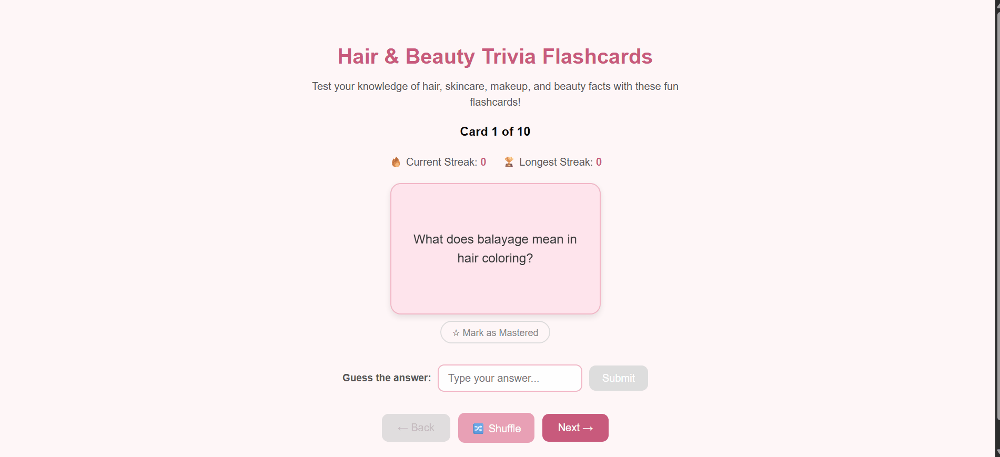

# Web Development Project 3 - *Hair & Beauty Trivia Flashcards*

Submitted by: **Shiyu Zhang**

This web app: **An interactive flashcard app that quizzes users on hair, skincare, and beauty trivia. Users can guess answers with fuzzy matching, navigate sequentially through cards, shuffle the deck, track their correct-answer streaks, and mark cards as mastered.**

Time spent: **6** hours spent in total

## Required Features

The following **required** functionality is completed:

- [x] **The user can enter their guess into an input box *before* seeing the flipside of the card**
  - Application features a clearly labeled input box with a submit button where users can type in a guess
  - Clicking on the submit button with an **incorrect** answer shows visual feedback that it is wrong
  -  Clicking on the submit button with a **correct** answer shows visual feedback that it is correct
- [x] **The user can navigate through an ordered list of cardss**
  - A forward/next button displayed on the card navigates to the next card in a set sequence when clicked
  - A previous/back button displayed on the card returns to the previous card in the set sequence when clicked
  - Both the next and back buttons should have some visual indication that the user is at the beginning or end of the list (for example, graying out and no longer being available to click), not allowing for wrap-around navigation

The following **optional** features are implemented:

- [x] Users can use a shuffle button to randomize the order of the cards
  - Cards should remain in the same sequence (**NOT** randomized) unless the shuffle button is clicked
  - Cards should change to a random sequence once the shuffle button is clicked
- [x] A user’s answer may be counted as correct even when it is slightly different from the target answer
  - Answers are considered correct even if they only partially match the answer on the card
  - Examples: ignoring uppercase/lowercase discrepancies, ignoring punctuation discrepancies, matching only for a particular part of the answer rather than the whole answer
- [x] A counter displays the user’s current and longest streak of correct responses
  - The current counter increments when a user guesses an answer correctly
  - The current counter resets to 0 when a user guesses an answer incorrectly
  - A separate counter tracks the longest streak, updating if the value of the current streak counter exceeds the value of the longest streak counter
- [x] A user can mark a card that they have mastered and have it removed from the pool of displayed cards
  - The user can mark a card to indicate that it has been mastered
  - Mastered cards are removed from the pool of displayed cards and added to a list of mastered cards

The following **additional** features are implemented:

* [x] Input is automatically disabled after flipping the card to prevent cheating
* [x] Guess input resets automatically when navigating to a new card
* [x] A completion screen is shown when all cards are mastered, with a "Reset All" button
* [x] Keyboard support — pressing Enter submits the guess

## Video Walkthrough

Here's a walkthrough of implemented user stories:

<!-- Replace this with whatever GIF tool you used! -->
GIF created with [ScreenToGif](https://www.screentogif.com/) for Windows  
<!-- Recommended tools:
[Kap](https://getkap.co/) for macOS
[ScreenToGif](https://www.screentogif.com/) for Windows
[peek](https://github.com/phw/peek) for Linux. -->

## Notes

- **Managing multiple interdependent state variables**: Keeping `currentPosition`, `cardOrder`, `masteredIds`, `isFlipped`, and `guessKey` in sync was tricky — for example, when a user masters a card, the position index needs to be recalculated to avoid pointing at a removed card.
- **Fuzzy matching logic**: Deciding how lenient the answer-checking should be was a balancing act. Pure substring matching was too loose (short words like "it" would match anything), so I implemented word-level matching with a minimum word length threshold and a 50% match ratio.
- **Resetting the GuessInput component on card navigation**: Since the input component has its own local state (`guess`, `feedback`), simply changing the parent's state didn't clear it. I solved this by using a `key` prop that increments on each card change, forcing React to remount the component with fresh state.
- **Preventing cheating by flipping first**: I needed to disable the guess input after the card is flipped so users can't peek at the answer and then type it in. Coordinating the `isFlipped` state between the parent and the input component required careful prop passing.
- **Sequential navigation with shuffle and mastered cards**: The card order can be shuffled, and mastered cards are filtered out, so the "position" the user sees is an index into a filtered + reordered list, not the original array. Keeping the Back/Next buttons correctly enabled/disabled at the boundaries of this dynamic list required careful index math.

## License

    Copyright [2026] [Shiyu Zhang]

    Licensed under the Apache License, Version 2.0 (the "License");
    you may not use this file except in compliance with the License.
    You may obtain a copy of the License at

        http://www.apache.org/licenses/LICENSE-2.0

    Unless required by applicable law or agreed to in writing, software
    distributed under the License is distributed on an "AS IS" BASIS,
    WITHOUT WARRANTIES OR CONDITIONS OF ANY KIND, either express or implied.
    See the License for the specific language governing permissions and
    limitations under the License.